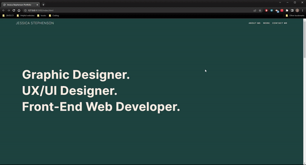

# Bootstrap-Portfolio
Bootstrap portfolio for Jessica Stephenson

# Description
Portfolio for Jessica Stephenson - Junior Front-End Web Developer.
Recreate my personal portfolio using as much Bootstrap as possible to showcase my up and coming projects. 

I have chosen to use my own placeholder images as these are more visually appealing. With more time I would like to update my portfolio to show not only that I am a web developer but I also have a background in UX/UI and Graphic Design. 
> **Note**: please see roadmap section

> **Note**: All projects within this portfolio are placeholders except the Horiseon code refactor project. All placeholder projects will link to the Horiseon code refactor project page.

# Criteria

Using Bootstrap, recreate your portfolio site with the following items:
The website should include the following bootstrap components:

* A Navigation bar and a navigation menu at the top.
* Include links that are applicable to your portfolio. Links should navigate to the appropriate sections
* A hero section
* A jumbotron featuring your picture, your name, and any other information you'd like to include.
* A work section that displays your work in grid.
* Use bootstrap cards for each project.The description should give a brief overview of the work.
* A skills section
* An "About Me" section 
* A footer section.
* All hyperlinks should have a hover effect.
* All buttons should display a box shadow upon hover.
* Your Bootstrap solution should minimize use of media queries.

> **Note**: Multiple comments within the code to show workings/understanding 

# Technologies Used
This portfolio was created using 
* HTML
* CSS
* Javascript
* (Bootstrap)

# Screenshot
Once deployed the website can be viewed in a traditional desktop browser.

The following images show the web application's appearance and functionality at different screen sizes:
## Desktop View

## Tablet View
 This layout has been designed for viewing on a slightly smaller screen that the screenshot above, so you may notice that some of the elements have been changed to fit a resolution. These include but not limited to the navigation bar and the way the projects are now displayed.

## Mobile View
This layout has been designed for viewing on a slightly smaller screen that the screenshot above, so you may notice that some of the elements have been changed to fit a resolution. These include but not limited to the navigation bar and the way the projects are now displayed.

> **Note**: This layout has been designed for viewing on a slightly smaller screen that the screenshot above, so you may notice that some of the elements have been changed to fit a resolution. These include but not limited to the navigation bar and the way the projects are now displayed.

# Deployed Page
Link to deployed site 
https://jessie93.github.io/Bootstrap-Portfolio/

# Roadmap

I would like to incorporate my UX/UI and Graphic Design working into my portfolio to show that I also 8+ years working in the design field. 

I would like to remove the profile picture and stick it in the ‘about me section’ Please view the gif attached. These updates are not complete but when they are I will add a link to my deployed site. 

# License 
MIT License

Copyright (c) [2022] [Jessica Stephenson]

Permission is hereby granted, free of charge, to any person obtaining a copy
of this software and associated documentation files (the "Software"), to deal
in the Software without restriction, including without limitation the rights
to use, copy, modify, merge, publish, distribute, sublicense, and/or sell
copies of the Software, and to permit persons to whom the Software is
furnished to do so, subject to the following conditions:

The above copyright notice and this permission notice shall be included in all
copies or substantial portions of the Software.

THE SOFTWARE IS PROVIDED "AS IS", WITHOUT WARRANTY OF ANY KIND, EXPRESS OR
IMPLIED, INCLUDING BUT NOT LIMITED TO THE WARRANTIES OF MERCHANTABILITY,
FITNESS FOR A PARTICULAR PURPOSE AND NONINFRINGEMENT. IN NO EVENT SHALL 
